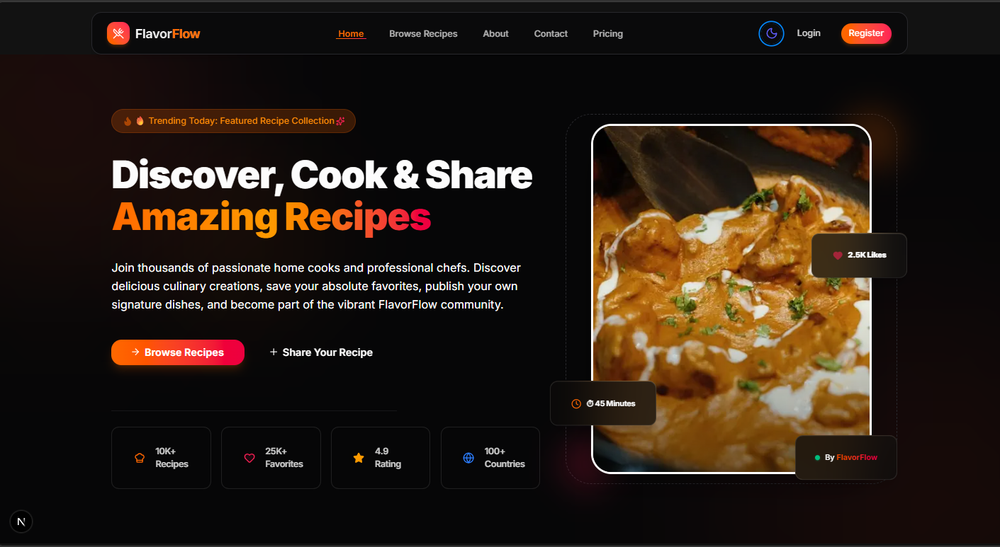

# 🍽️ Flavor Flow

A modern recipe discovery and sharing platform built with Next.js. Flavor Flow allows users to browse recipes, save favorites, create custom recipes, manage subscriptions, and access role-based dashboards with administrative capabilities.



---

## 🔗 Live Demo & Links

- 🌐 **Live Website**: [https://flavor-flow-one.vercel.app](https://flavor-flow-one.vercel.app)

---

## 📖 Overview

Flavor Flow is a full-stack web application providing a comprehensive recipe management system with user authentication, subscription-based access, and admin controls. The platform supports recipe discovery, user-generated content, favorites management, and payment processing through Stripe.

---

## 🛠️ Tech Stack & Technologies

### Frontend
- **Framework**: Next.js 16 with React 19
- **Styling**: Tailwind CSS 4, HeroUI component library
- **Animations**: Framer Motion
- **Icons**: Lucide React, React Icons
- **Theming**: next-themes (light/dark mode switching)

### Backend
- **Authentication**: Better Auth (email/password + Google OAuth)
- **Payments**: Stripe API for subscription checkout and payment processing
- **API**: Next.js App Router API routes and server actions

### Database & Storage
- **Database**: MongoDB (via Better Auth MongoDB adapter)

### Development Tools
- ESLint for code quality
- React Compiler for optimized rendering

---

## Key Features

### 🍳 Recipe Management
- Browse and search recipes from the public catalog
- View detailed recipe information and instructions
- Create and manage personal recipes
- Save favorite recipes for quick access
- Track recipe interactions through reports

### 🔐 User System
- Email and password authentication
- Google OAuth integration
- User profiles with customizable settings
- Role-based access control (admin and user roles)
- Account status management and user blocking capabilities

### 📊 Dashboard Features
- **User Dashboard**: manage personal recipes, favorites, profile, and purchases
- **Admin Dashboard**: user management, recipe moderation, transaction monitoring, and analytics reports
- Real-time transaction and subscription tracking

### 💳 Subscription and Payments
- Stripe-integrated payment processing
- Subscription checkout sessions
- Payment completion and failure handling
- Transaction history tracking

### 🎨 UI and Theming
- Theme support via next-themes for light/dark mode switching
- Responsive design using Tailwind CSS and HeroUI components
- Smooth animations with Framer Motion

---

## 📁 Project Structure

```
src/
├── app/                  — Application routes and pages organized by feature
│   ├── (auth)/           — Authentication pages (login, register)
│   ├── api/               — API routes for auth, payments, checkout, and webhooks
│   ├── dashboard/         — Role-based user dashboards (admin and user sections)
│   ├── recipes/           — Recipe browsing and detail pages
│   ├── plans/             — Subscription and pricing pages
│   └── ...                — About, contact, and other public pages
│
├── components/           — Reusable React components
│   ├── dashboard/         — Dashboard-specific components (navbar, sidebar)
│   ├── home/               — Homepage section components
│   ├── shared/             — Global components (navbar, footer, cards)
│   └── browseJobs/         — Recipe cards and browsing components
│
└── lib/                  — Utilities, helpers, and server-side logic
    ├── actions/            — Server actions for data mutations (recipes, users, payments, etc.)
    ├── api/                — API client functions for backend communication
    ├── core/               — Session management and core utilities
    └── data.json           — Static recipe data

config/                   — Application configuration (dashboard navigation)
public/                   — Static assets
```

---

## 🚀 Getting Started

### Prerequisites
- Node.js 18 or higher
- npm or yarn
- MongoDB instance
- Stripe account
- Google OAuth credentials (optional, for social login)

### Installation

Install dependencies:

```bash
npm install
```

### Environment Variables

Create a `.env.local` file in the project root:

```
MONGODB_URI=your_mongodb_connection_string
Client_ID=your_google_client_id
Client_secret=your_google_client_secret
STRIPE_SECRET_KEY=your_stripe_secret_key
STRIPE_PUBLISHABLE_KEY=your_stripe_publishable_key
```

### Development

Start the development server:

```bash
npm run dev
```

Open [http://localhost:3000](http://localhost:3000) in your browser.

### Production

Build for production:

```bash
npm run build
```

Start the production server:

```bash
npm start
```

---

## 📜 Available Commands

| Command | Description |
|---|---|
| `npm run dev` | Start development server with hot reload |
| `npm run build` | Build application for production |
| `npm start` | Run production server |
| `npm run lint` | Run ESLint code quality checks |

---

## 🔌 API Endpoints

### Authentication
- `POST /api/auth/[...all]` — Better Auth endpoints for sign up, sign in, sign out, and session management

### Payments and Subscriptions
- `POST /api/checkout_sessions` — Create Stripe checkout session
- `POST /api/payment` — Handle payment webhooks and confirmations

### Admin and User Operations
- `GET /api/recipes` — Fetch recipes
- `POST /api/recipes` — Create recipes (server action)
- `POST /api/user` — User operations
- `GET /api/admin` — Admin-specific queries
- `POST /api/report` — Create reports
- `GET /api/transaction` — Transaction history

---

## 🧩 Key Implementation Details

### Authentication System
- Handled by Better Auth with MongoDB adapter
- Email/password login with optional auto sign-in disabled
- Google OAuth social provider support
- Custom user fields: `role`, `isBlocked`, `planId`

### Role-Based Access Control
- **Admin users**: full dashboard access with user management, recipe moderation, and reporting
- **Regular users**: personal dashboard with recipe management and profile settings

### Data Fetching
- Server-side data fetching using Next.js App Router
- Revalidation strategy for cache management
- API routes for dynamic data and mutations

---

## ☁️ Deployment

This application is optimized for deployment on Vercel or any platform supporting Next.js. Before deploying:

1. Configure all environment variables for MongoDB, Stripe, and Google OAuth
2. Ensure MongoDB is accessible from production environment
3. Set up Stripe webhooks pointing to your production API routes
4. Test payment flow and authentication in staging environment
5. Review and set appropriate CSP headers and security configurations

For Vercel deployment, connect your GitHub repository and configure environment variables in the project settings.

---

## 📐 Development Guidelines

### Code Organization
- Server-side logic in `actions/` and `api/` folders
- Client components in `components/` folder
- Shared utilities in `lib/` folder
- API clients and data operations in `lib/api/`

### Best Practices
- Use Server Components for data fetching
- Use Client Components (`'use client'`) only when necessary for interactivity
- Implement proper error boundaries for error handling
- Follow the existing naming conventions and folder structure

---

## 📝 Notes

- Homepage defined in `src/app/page.js`
- Authentication logic in `src/app/lib/auth.js`
- Dashboard layouts managed through Next.js layout system
- All API routes follow Next.js App Router conventions
- Database operations abstracted through action functions

---

## 👤 Author

**Md Riad Shekh**

- 📧 Email: [riadswebdev@gmail.com](mailto:riadswebdev@gmail.com)
- 🌐 Website: [https://flavor-flow-one.vercel.app](https://flavor-flow-one.vercel.app)
- 💼 LinkedIn: [www.linkedin.com/in/riad-shekh](https://www.linkedin.com/in/riad-shekh)
